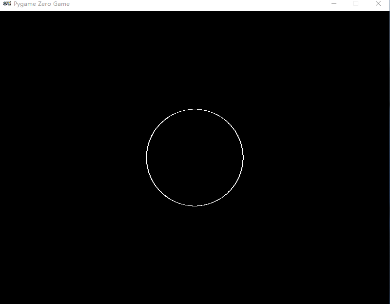
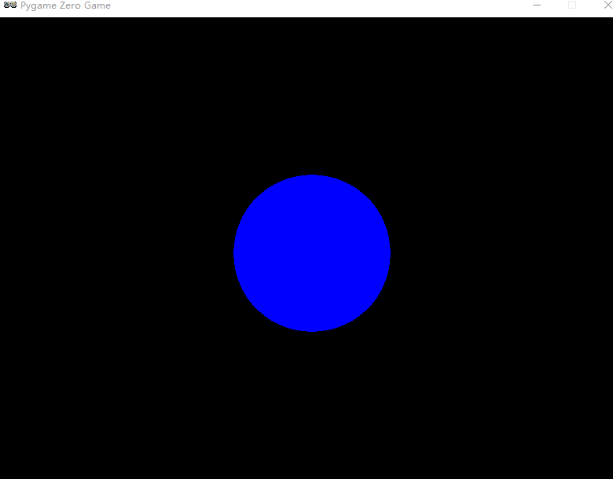
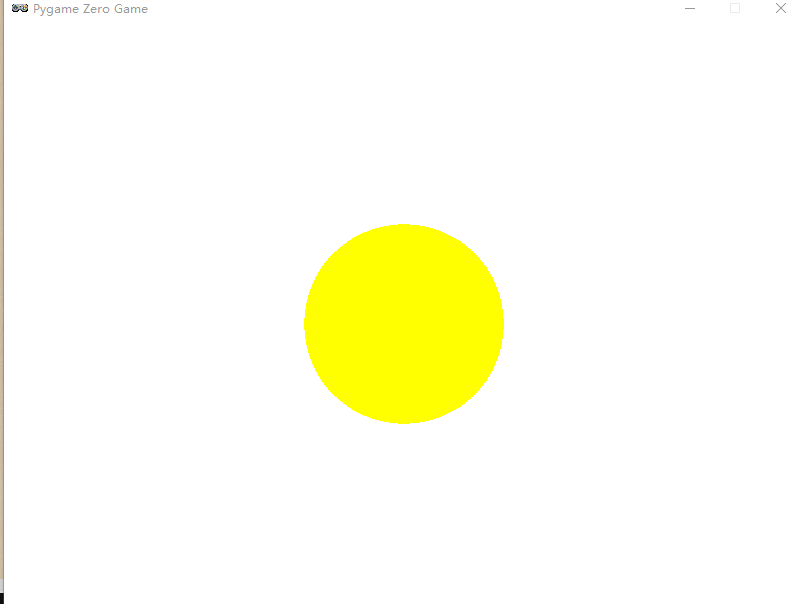
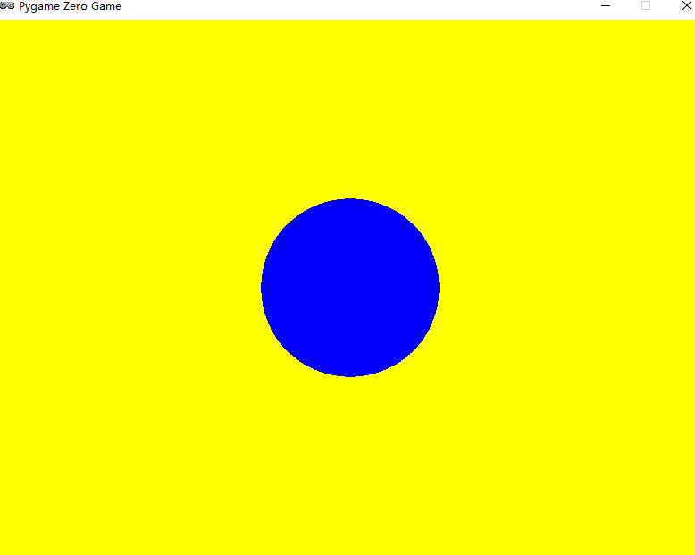
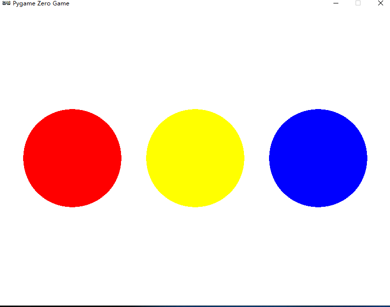
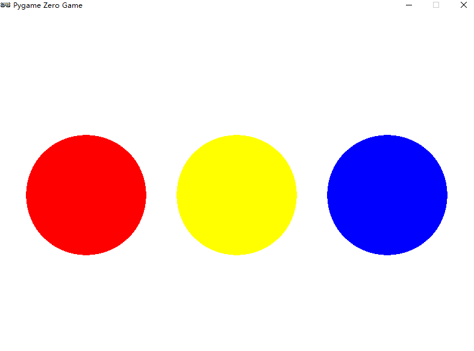
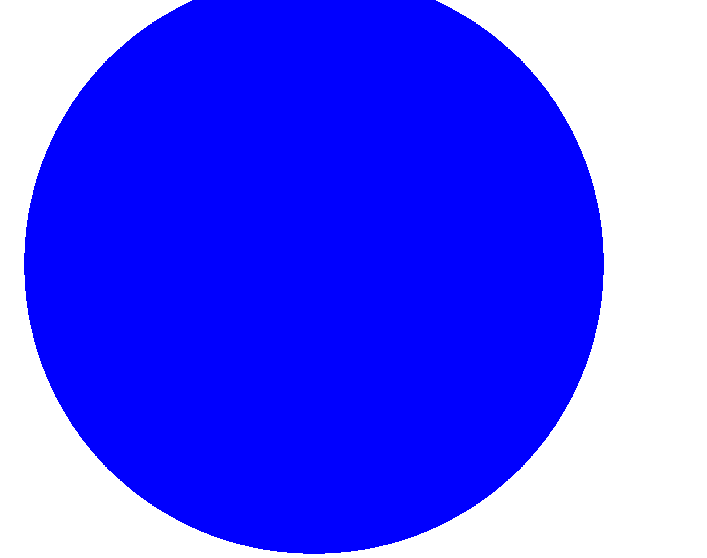
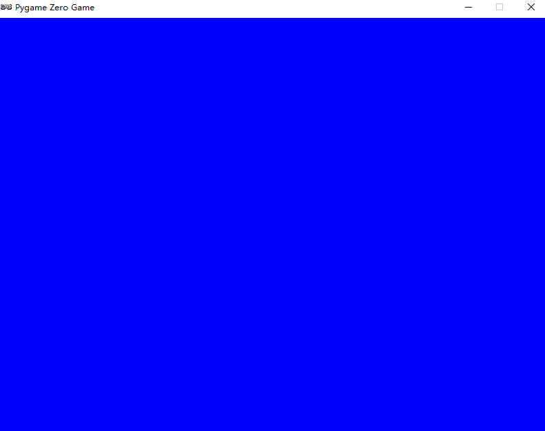
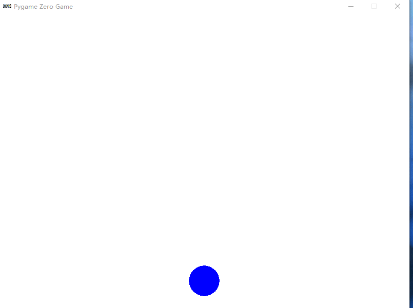
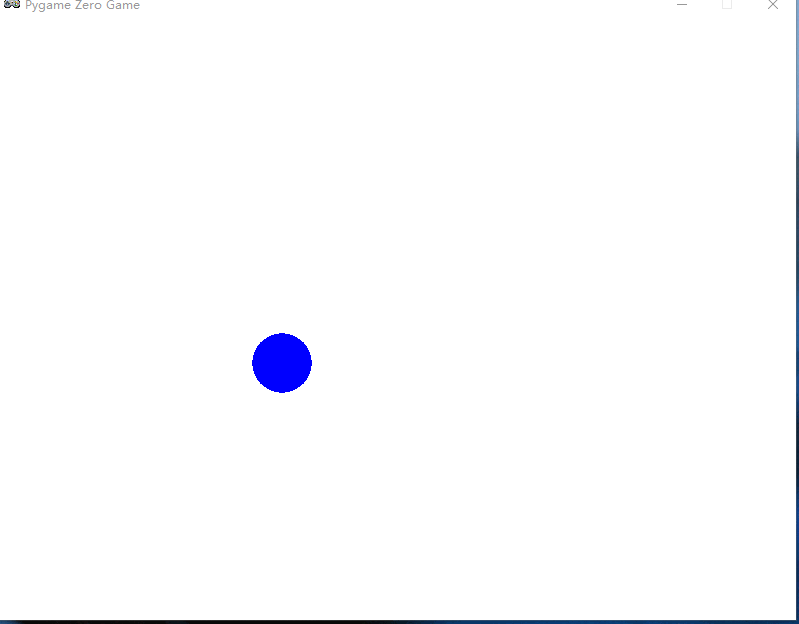

# 2  弹跳的小球

## 2-2 显示静止的小球

### 2-2-01 绘制静止小球

```python
import pgzrun


def draw():
    # 绘制一个圆心在400,300，半径为100的白色圆
    screen.draw.circle((400, 300), 100, 'white')


pgzrun.go()
```

#### 显示效果



### 练习 2-1 修改上述代码

```python
import pgzrun


def draw():
    screen.draw.circle((400, 200), 50, 'red')


pgzrun.go()
```

#### 显示效果


### 2-2-02 显示静止的实心小球

```python
import pgzrun


def draw():
    screen.draw.filled_circle((400,300),100,'blue')


pgzrun.go()
```

#### 显示效果



## 2-3 设置小球与背景的颜色

### 2-3-01 绘制红色的小球

```python
import pgzrun


def draw():
    screen.draw.filled_circle((400,300),100,'red')


pgzrun.go()
```

### 2-3-02 修改显示背景的颜色

```Python
import pgzrun


def draw():
    # 修改背景颜色
    screen.fill('white')
    screen.draw.filled_circle((400,300),100,'yellow')


pgzrun.go()
```

#### 显示效果



### 练习 2-3  绘制黄色背景的蓝色小球

```python
import pgzrun


def draw():
    # 修改背景颜色
    screen.fill('yellow')
    screen.draw.filled_circle((400,300),100,'blue')


pgzrun.go()
```

#### 显示效果



## 2-4 显示多个静止小球

### ==**游戏窗口的绘制区域说明**==

1. 游戏窗口的绘制区域采用直角坐标系
2. 左上角的坐标为（0,0）
3. 横轴方向由x坐标表示，取值范围[0-800];纵轴方向由y坐标表示，取值范围为[0-600]
4. 游戏窗口内的任一点位置都可以由（x,y）坐标来表示

### 2-4-01 绘制不同位置的三个小球

```python
import pgzrun


def draw():
    # 修改背景颜色
    screen.fill('white')
    # 绘制三个不同位置的小球
    screen.draw.filled_circle((150, 300),100,'red')
    screen.draw.filled_circle((400, 300), 100, 'yellow')
    screen.draw.filled_circle((650, 300), 100, 'blue')


pgzrun.go()
```

#### 显示效果



#### 补充：当然也可以修改这三个小球的半径及y坐标

## 2-5 利用变量修改多个小球的参数

### 2-5-01 使用变量记录小球的半径信息

```python
import pgzrun
# 使用变量存储所绘制小球的半径
r = 100

def draw():
    # 修改背景颜色
    screen.fill('white')

    # 绘制三个不同位置的小球
    screen.draw.filled_circle((150, 300), r,'red')
    screen.draw.filled_circle((400, 300), r, 'yellow')
    screen.draw.filled_circle((650, 300), r, 'blue')


pgzrun.go()
```

#### 显示效果



## 2-6 绘制逐渐变大的小球 - 控制小球的大小的是半径r

### 2-6-01 动态修改半径r的值-==global语句==

```python
import pgzrun

# 使用变量存储所绘制小球的半径
r = 100

def draw():
    # 修改背景颜色
    screen.fill('white')

    screen.draw.filled_circle((400, 300), r, 'blue')

# 添加更新代码
def update():
    global r  # 使用global语句对变量r进行全局修改
    r += 1


pgzrun.go()
```

#### 显示效果





挤满了整个绘制窗口的区域

### 2-6-02 ==update函数==

def update(): 定义了一个更新函数，当程序运行后，每帧都会执行一次该函数。其中的语句r = r + 1表示半径r每次增加1，使得小球的半径从1开始，依次增加为2、3、4、5、6……

### 2-6-03 ==global语句理解==

global r语句表示r为全局变量，如果函数内部需要修改函数外部的变量，如在update()函数中修改函数外定义的变量r，就需要在函数内部加上global r这一语句。

### 2-6-04 整个程序运行的过程

```python
"""
和update()函数一样，绘制函数draw()也是每帧重复运行的。代码首先运行函数外的r = 1语句，然后运行update函数()，变量r增加1；运行draw()函数，首先执行语句screen.fill('white')用白色填充整个画布，再执行语句screen.draw.filled_circle((400, 300), r, 'red')绘制半径为r的实心红色球；重复执行update()、draw()函数。如此迭代运行，就实现了小球慢慢变大的动画效果。
"""
```

## 2-7控制小球逐渐下落-修改小球的y坐标

### 2-7-01 绘制不断下落的小球，并使得小球运动到边界时（假设r=30,那么y=600-30=570）停止下落

```python
import pgzrun

# 设定小球的初始Y坐标
y = 100
def draw():
    # 修改背景颜色
    screen.fill('white')

    screen.draw.filled_circle((400, y), 30, 'blue')

# 添加更新代码
def update():
    global y # 使用global语句对变量y进行全局修改
    y += 1
    if y >= 570:  # 如果运行到边界时，停止修改y坐标
        y = 570


pgzrun.go()

```

## 2-8 利用if语句实现小球重复下落

说明：即小球完全消失在绘制窗口（y=630时），使得y=-30，重新进入绘制串口，再次进行下落

```python
import pgzrun

# 设定小球的初始Y坐标
y = 100
def draw():
    # 修改背景颜色
    screen.fill('white')

    screen.draw.filled_circle((400, y), 30, 'blue')

# 添加更新代码
def update():
    global y # 使用global语句对变量y进行全局修改
    y += 1
    if y >= 630: # 下落到最底部小时
        y = -30  # 回到最顶部


pgzrun.go()

```

## 2-9 上下反弹的小球

说明：上下反弹，则说明要修改小球的y坐标
（即小球运行到最底部时增加小球的y坐标值，到最顶部时减少小球的y坐标值）

### 2-9-01 绘制上下弹跳的小球

```Python
import pgzrun

# 设定小球的初始Y坐标
y = 100

# 设定小球下降和上升的速度
speed_y = 3
def draw():
    # 修改背景颜色
    screen.fill('white')

    screen.draw.filled_circle((400, y), 30, 'blue')

# 添加更新代码
def update():
    global y, speed_y # 使用global语句对变量y,speed_y进行全局修改
    y += speed_y
    if y >= 570 or y <= 30 : # 小球碰触到最底部时或者碰触到最顶部时
        speed_y = -speed_y


pgzrun.go()

```

#### 显示效果



### 2-9-02使用变量替代上述代码中的数字-显示的效果是相同的

```python 
import pgzrun

# 绘制窗口的代销
HEIGHT = 600
WIDTH = 800

# 设定小球的初始Y坐标
y = 100

# 设定小球下降和上升的速度
speed_y = 3

# 小球的半径r
r = 30
def draw():
    # 修改背景颜色
    screen.fill('white')

    screen.draw.filled_circle((WIDTH / 2, y), r, 'blue')

# 添加更新代码
def update():
    global y, speed_y # 使用global语句对变量y,speed_y进行全局修改
    y += speed_y
    if y >= HEIGHT - r or y <= r : # 小球碰触到最底部时或者碰触到最顶部时
        speed_y = -speed_y


pgzrun.go()
```

## 2-10 倾斜弹跳的小球

2-10-01 添加影响x坐标的因素

```python
import pgzrun

# 绘制窗口的代销
HEIGHT = 600
WIDTH = 800

# 设定小球的初始X Y坐标
x = 100
y = 100

# 设定小球下降和上升的速度
speed_y = 3
speed_x = 4

# 小球的半径r
r = 30
def draw():
    # 修改背景颜色
    screen.fill('white')

    screen.draw.filled_circle((x, y), r, 'blue')

# 添加更新代码
def update():
    global y, speed_y, x, speed_x # 使用global语句对变量y,speed_y进行全局修改
    y += speed_y
    x += speed_x
    if y >= HEIGHT - r or y <= r: # 小球碰触到最底部时或者碰触到最顶部时
        speed_y = -speed_y
    if x >= WIDTH - r or x <= r:  # 小球碰到左右边界时回弹
        speed_x = -speed_x

pgzrun.go()

```

### 倾斜弹跳的小球显示效果

