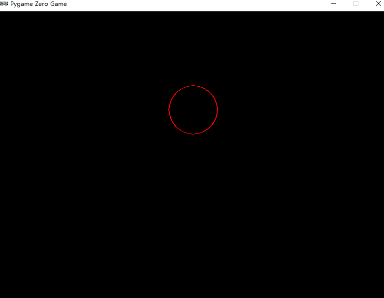

# 2  弹跳的小球

## 2-2-01 显示静止的小球

```python
import pgzrun


def draw():
    # 绘制一个圆心在400,300，半径为100的白色圆
    screen.draw.circle((400, 300), 100, 'white')


pgzrun.go()
```

### 显示效果


## 练习 2-1 修改上述代码

```python
import pgzrun


def draw():
    screen.draw.circle((400, 200), 50, 'red')


pgzrun.go()
```

### 显示效果



## 2-2-02 显示静止的实心小球

```python
import pgzrun


def draw():
    screen.draw.filled_circle((400,300),100,'blue')


pgzrun.go()
```

### 显示效果


## 2-3-01 设置小球与背景的颜色

说明：绘制红色的小球

```python
import pgzrun


def draw():
    screen.draw.filled_circle((400,300),100,'red')


pgzrun.go()
```

