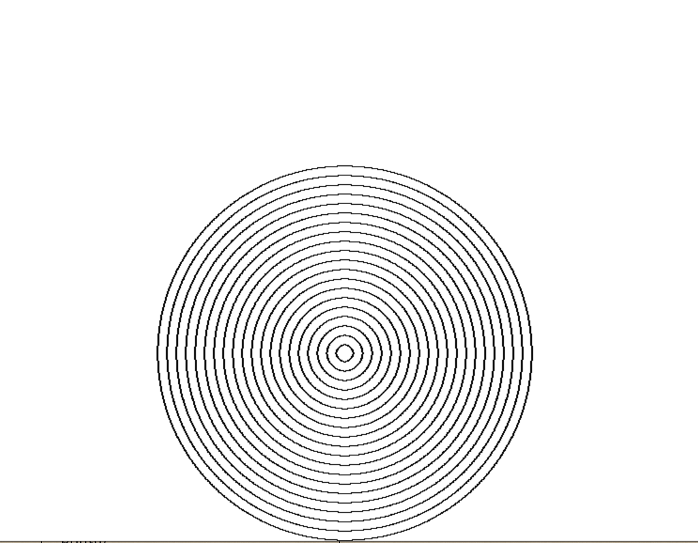
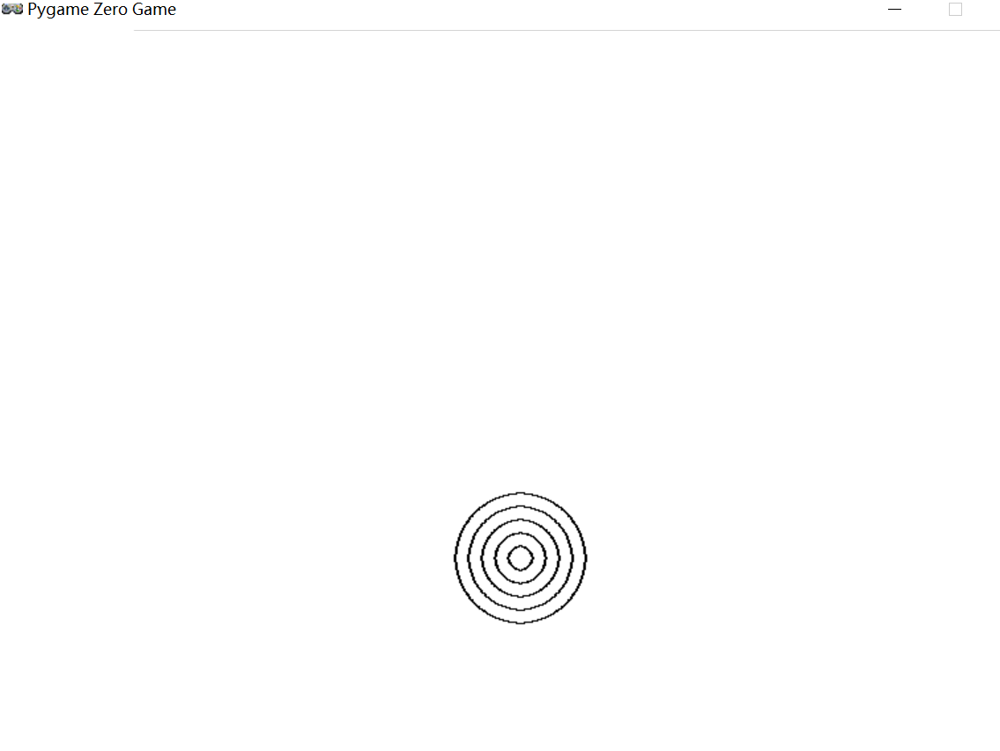
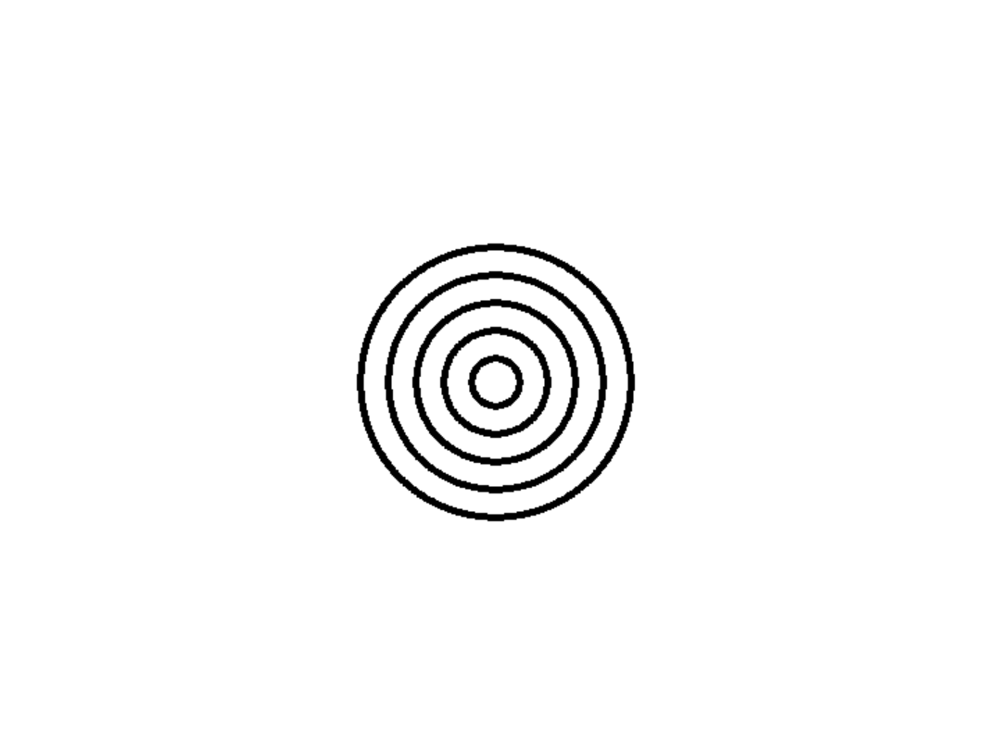
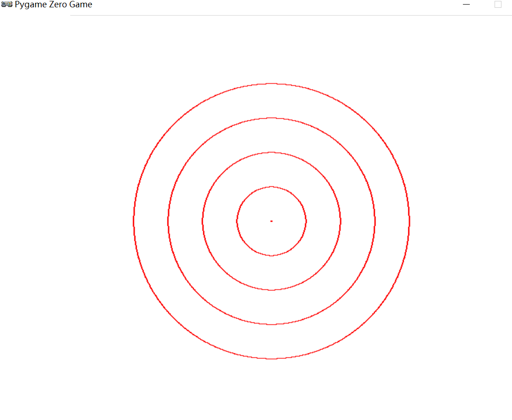
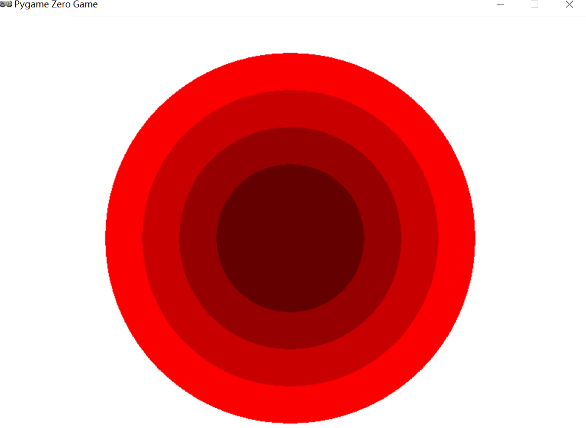
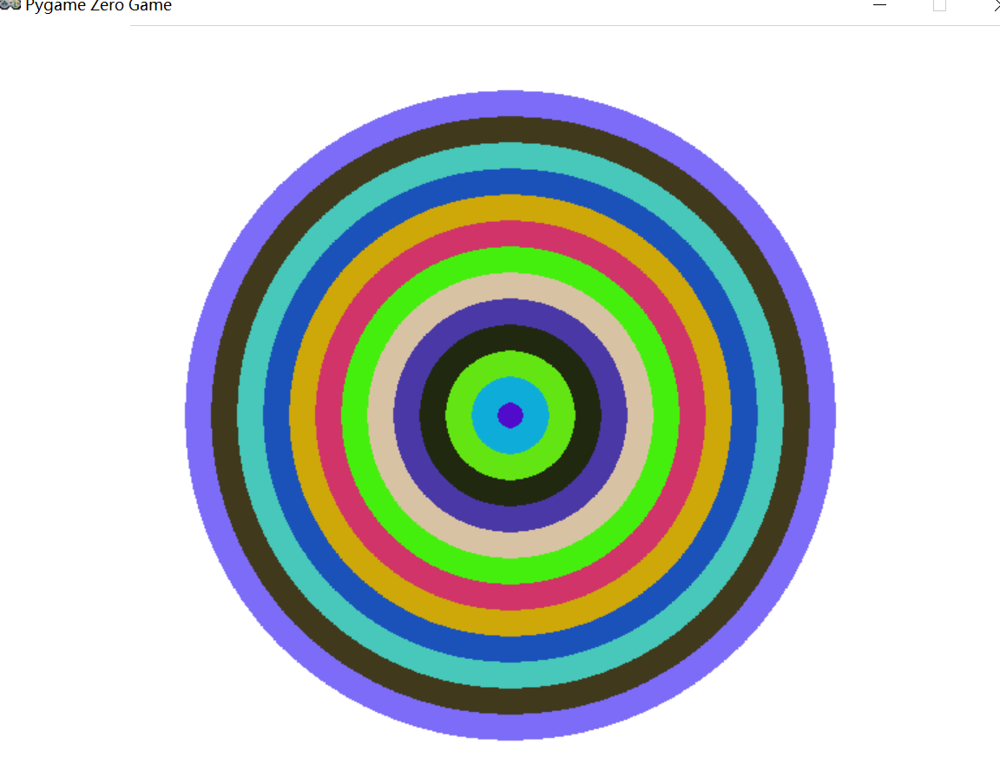

# 03  圆圈画计划启动

## 3.1 使用for循环绘制同心圆

### 3.1.1 所需要的函数

```python
"""
def draw() - 绘制的函数
	screen.fill(color) - 绘制背景，指定颜色
	screen.draw.circle((x,y),r,color)
		参数介绍：x,y 表示所绘制圆的圆心坐标
		r - 圆的半径
		color - 圆的颜色-也可以说是笔的颜色
"""

```

### 3.1.2 使用for循环绘制20层同心圆

```python
# 绘制多层同心圆
import pgzrun 
def draw():
    # 绘制背景
    screen.fill('white')
    for i in range(1,21):
        screen.draw.circle((400,400), 10 * i,'black')

# 开始绘制
pgzrun.go()
```

#### 显示效果

### 3.1.3 使用for循环绘制5层同心圆-使用range函数的step参数

#### 示例代码

```python
# 绘制多层同心圆
import pgzrun 
def draw():
    # 绘制背景
    screen.fill('white')
    for r in range(10,51,10):  # 指定range函数的步长
        screen.draw.circle((400,400), r,'black')

# 开始绘制
pgzrun.go()
```


#### 显示效果

## 3.2 绘制特殊的同心圆

### 3.2.1 实现

说明：所需要的函数

```python
# range(start,end[,step])
# screen.draw.filled_circle((x,y),r,color)
```


### 3.2.2 示例代码

```python 
# 绘制特殊的同心圆
import pgzrun


def draw():
    # 绘制背景
    screen.fill('white')
    for r in range(100,1,-20):  # 指定range函数的步长
        screen.draw.filled_circle((400, 300), r , 'black')
        screen.draw.filled_circle((400, 300), r-5 , 'white')


# 开始绘制
pgzrun.go()

```


### 3.2.3 显示效果

## 3.3 颜色的表示

颜色的不同表示方式：可以使用(r,g,h)颜色分量来表示不同的颜色

```
screen.fill((0, 0, 0)) 　　　 　　# 黑色背景
screen.fill((255, 255, 255))  　 # 白色背景
screen.fill((150, 150, 150))  　 # 灰色背景
screen.fill((255, 0, 0))  　　　 # 红色背景
screen.fill((120, 0, 0))  　　　 # 暗红色背景
screen.fill((0, 255, 0))  　　　 # 绿色背景
screen.fill((0, 0, 255))  　　　 # 蓝色背景
screen.fill((255, 255, 0))  　　 # 黄色背景
```


### 3-3-01 使用颜色分量绘制不同颜色的同心圆

```Python
# 使用rgb颜色分量绘制同心圆
import pgzrun


def draw():
    # 绘制背景
    screen.fill((255,255,255))
    for r in range(1, 251, 50):
        screen.draw.circle((400, 300), r, (255, 0, 0))


# 开始绘制
pgzrun.go()

```

#### 显示效果



### 3-3-02 使用颜色分量绘制填充圆

```python
# 使用rgb颜色分量绘制同心圆
import pgzrun


def draw():
    # 绘制背景
    screen.fill((255,255,255))
    for r in range(250, 50, -50):
        screen.draw.filled_circle((400, 300), r, (r, 0, 0))


# 开始绘制
pgzrun.go()

```

#### 显示效果



### 3-3-03 练习-使用颜色分量绘制特殊的填充圆

说明:灵活运用range函数指定步长的作用和rgb表示各种不同颜色的方式

```python
# 使用rgb颜色分量绘制同心圆
import pgzrun


def draw():
    # 绘制背景
    HEIGHTH = 1000
    WIDTH = 1200
    screen.fill((255,255,255))  # 白色背景
    # # 绘制外黑内红的渐变圆
    # for r in range(0, 256, 1):
    #     screen.draw.filled_circle((400,300), 255-r,(r,0,0))
    # # 绘制外黑内黄的渐变圆
    # for r in range(0, 256, 1):
    #     screen.draw.filled_circle((400, 300), 255-r, (r, r, 0))
    # 绘制外灰内黑的渐变圆
    for r in range(150, 0, -1):
        screen.draw.filled_circle((400, 300), r, (r, r, r))


# 开始绘制
pgzrun.go()

```

### 3.4  绘制随机颜色的同心圆

说明：使用random模块结合rgb颜色分量绘制随机颜色同心圆

```python
# 使用rgb颜色分量绘制同心圆
import pgzrun
import random # 导入random库

# 随机颜色分量-取[0-255]之间的随机整数
R = random.randint(0, 255)
G = random.randint(0, 255)
B = random.randint(0, 255)


def draw():
    # 绘制背景
    screen.fill((255,255,255))  # 白色背景
    for r in range(250, 0, -20):
        R = random.randint(0, 255)
        G = random.randint(0, 255)
        B = random.randint(0, 255)
        screen.draw.filled_circle((400, 300), r, (R, G, B))


# 开始绘制
pgzrun.go()

```

#### 显示效果




